# ALBION JSECシステムガイドライン ver.1 要点版

対象PDF: `docs/albion/ALBION_JSECシステムガイドライン_vo1-1.pdf`

このドキュメントは、実装と運用で必要な要件のみを抽出した要点版です。

## 1) ページ構成（必須要件）

- ALBIONブランドTOPは以下の要素で構成する（表示順）。
- ① `ALBIONロゴ`、② `グローバルナビ`、③ `TOPバナー`、④ `NEW Items & Colors`、⑤ `RANKING`（任意）、⑥ `PRODUCTS`、⑦ `ONLINE COUNSELING`、⑧ `ABOUT ALBION`。
- `RANKING` は任意（掲載する場合はTOP掲載必須、販売数量TOP5を表示）。
- `ABOUT ALBION` は現時点では予定なし。

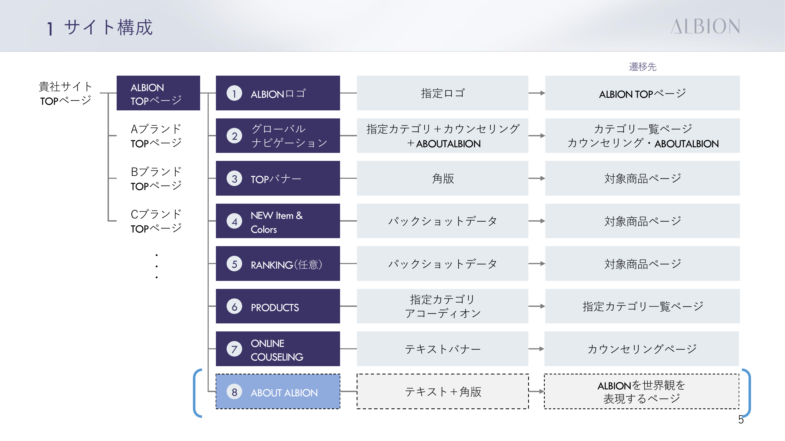

## 2) UI実装ルール（優先度高）

- ロゴ:
- ALBIONロゴは表示範囲の中央配置を必須。
- 認定ロゴとのサイズ・位置関係はガイド準拠。

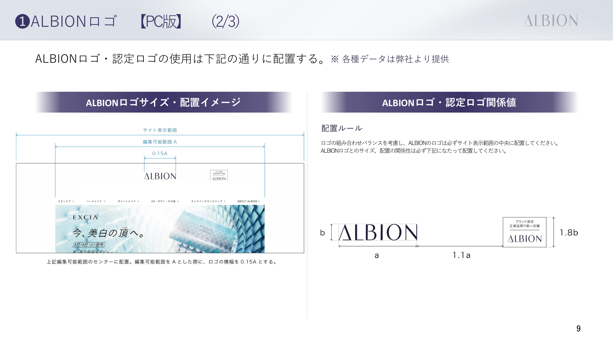
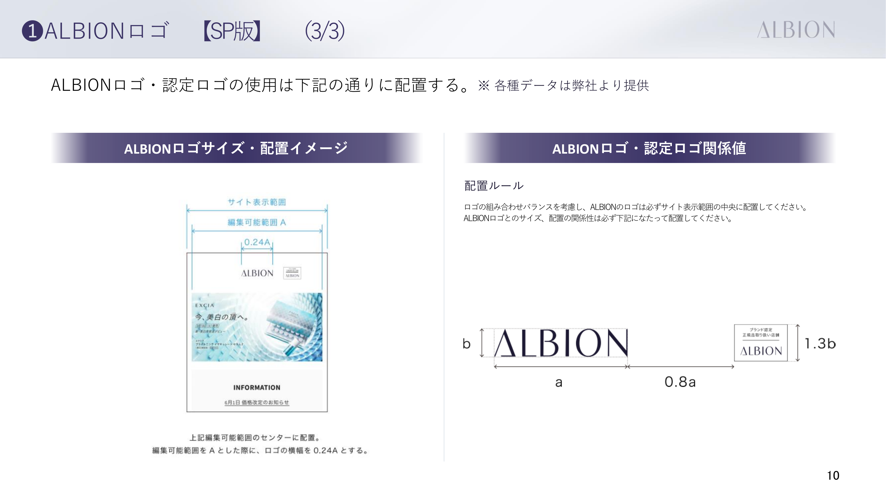

- グローバルナビ:
- 詳細カテゴリの並び順はガイド記載順に準拠。
- 各詳細カテゴリの遷移先はカテゴリ一覧ページ。

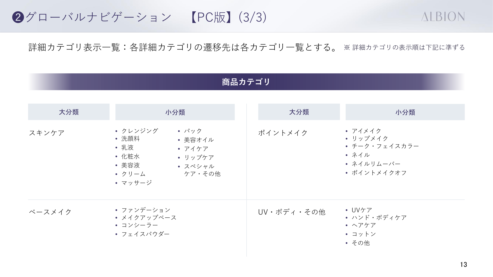

- TOPバナー:
- 角版を複数枚表示（横スクロール想定、掲載枚数は月ごと変動）。
- 画像形式はJPEG。
- 遷移先は単品または指定商品ページ。

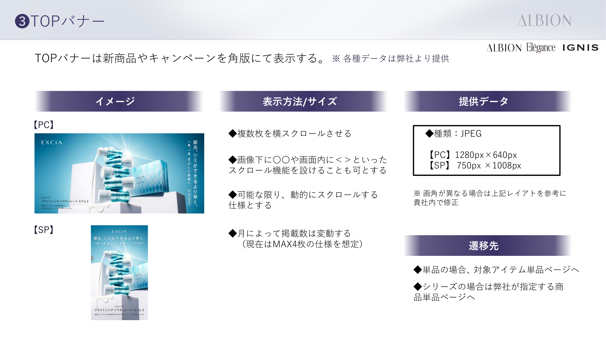

- PRODUCTS:
- **カテゴリから探す**: 主要カテゴリ4項目を表示。詳細カテゴリはPCでホバー/アコーディオン、SPでタップ展開。詳細カテゴリの表示順はグロナビ準拠。遷移先は対象カテゴリ一覧ページ。
- **マストアイテムを見る**: 主要カテゴリ下部に表示。指定の5品（増減の可能性あり）。商品詳細ページのデータを流用。遷移先は対象商品詳細ページ。
- **シリーズから探す**: 「マストアイテムを見る」の下部に表示。指定シリーズ（FLARUNE、INFINESSE、EXCIA等）の画像で一覧。遷移先は対象「シリーズ」カテゴリ一覧ページ。

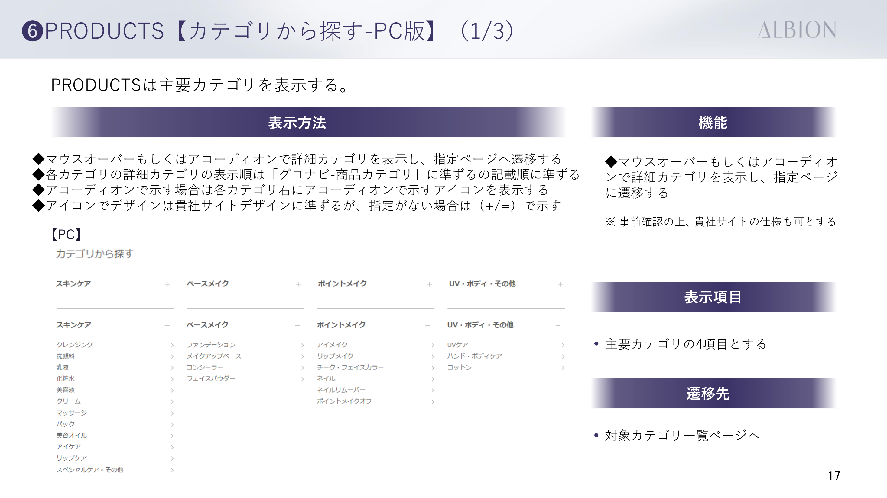

- ONLINE COUNSELING:
- `https://www.albion.co.jp/counseling/` への遷移を実装。
- グローバルナビからも同様に遷移。
- 貴社オンラインカウンセリングシステムで代替する場合: 高精細・高画質のクオリティを条件とし、弊社基準に沿った認可制。担当スタッフはオンラインカウンセリング専用教育の受講必須。

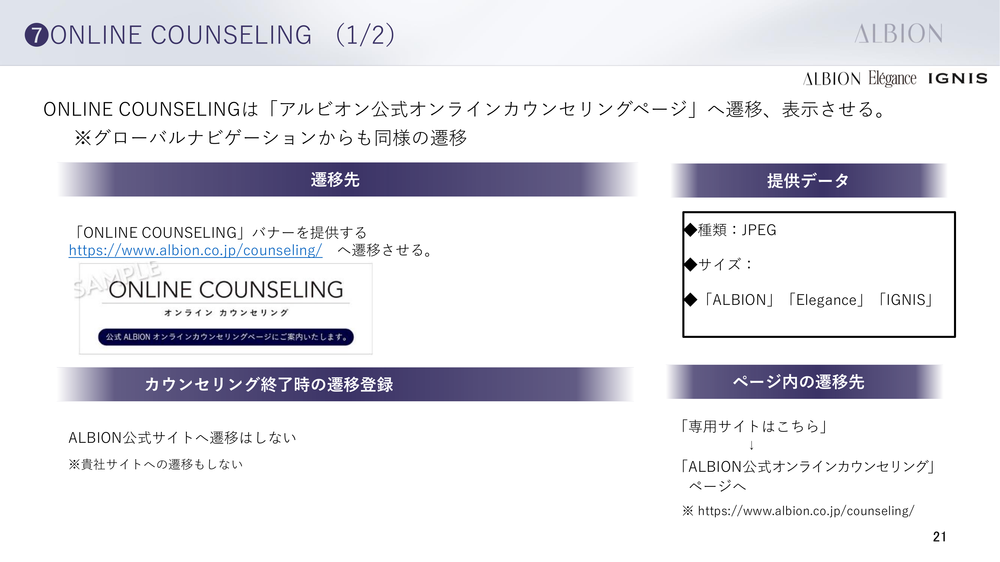

## 3) 購入前の肌安全性確認（必須）

- 商品購入前に肌安全性確認モーダルを表示する（必須）。
- 設問文は否定文で構成する（必須）。
- 画面種別は `アルゴリズム①(購入可)` / `アルゴリズム②(注意喚起)` / `アルゴリズム③(購入不可)` の3状態で出し分ける。

- 設問（チェック項目）:
- Q1: 現在、皮膚科に通院するような肌トラブルを起こしていない。（※肌トラブル：炎症・アトピー・赤味・はれ・かゆみ・刺激・色抜け(白斑)・黒ずみなど）
- Q2: 過去に化粧品で肌トラブルを起こしたことがない。
- Q3: 自身の肌は、揺らぎやすく、敏感・不安定ではない。
- 注記: ガイドライン上、カウンセリング設問は否定文で統一する。

- 判定ロジック（チェック結果）:
- `Q1=YES, Q2=YES, Q3=YES` -> アルゴリズム①（購入可）。
- `Q1=YES` かつ `Q2/Q3のいずれかがNO` -> アルゴリズム②（注意喚起）。
- `Q1=NO, Q2=NO, Q3=NO` -> アルゴリズム③（購入不可）。

- モーダル内遷移・操作:
- アルゴリズム①（購入可）:
- ボタン `お買い物を続ける` -> 商品ページ（元ページ）へ遷移。
- ボタン `カートを見る` -> カート画面へ遷移。
- アルゴリズム②（注意喚起）:
- ボタン `確認してカートに追加` -> アルゴリズム①へ遷移。
- ボタン `カートに入れてカウンセリングをする` -> カウンセリングページへ遷移。
- アルゴリズム③（購入不可）:
- ボタン `もう一度カウンセリングをする` -> 肌安全性確認（設問画面）へ戻す。
- ボタン `この画面を閉じる` -> 商品ページ（元ページ）へ遷移。

- 文言要件（アルゴリズム②/③）:
- アルゴリズム②: 商品情報・全成分の確認を促し、目立たない部位での試用確認を促す注意喚起文を表示する。
- アルゴリズム③: 「申し訳ございませんが販売できません。」を表示し、再カウンセリング導線を必ず表示する。

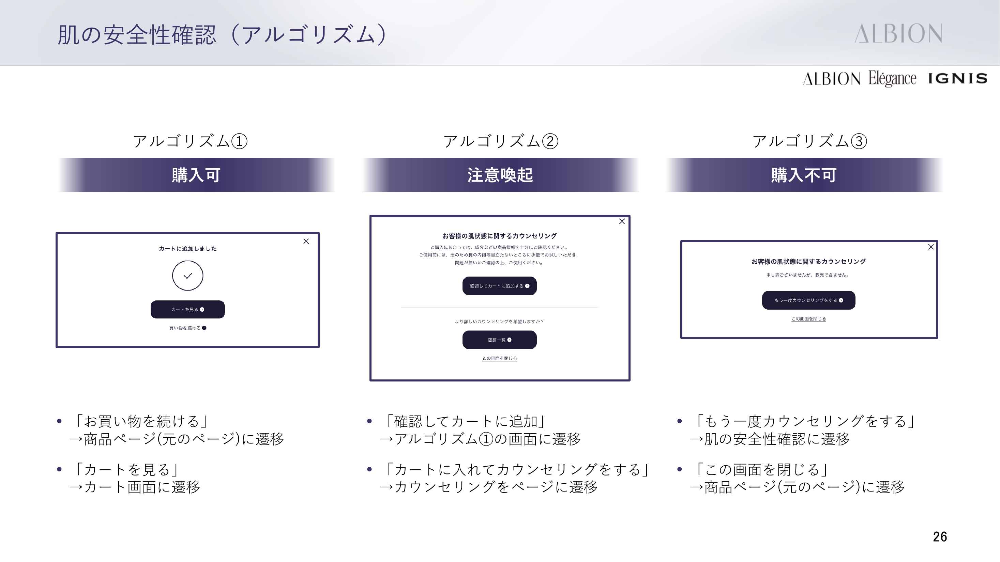
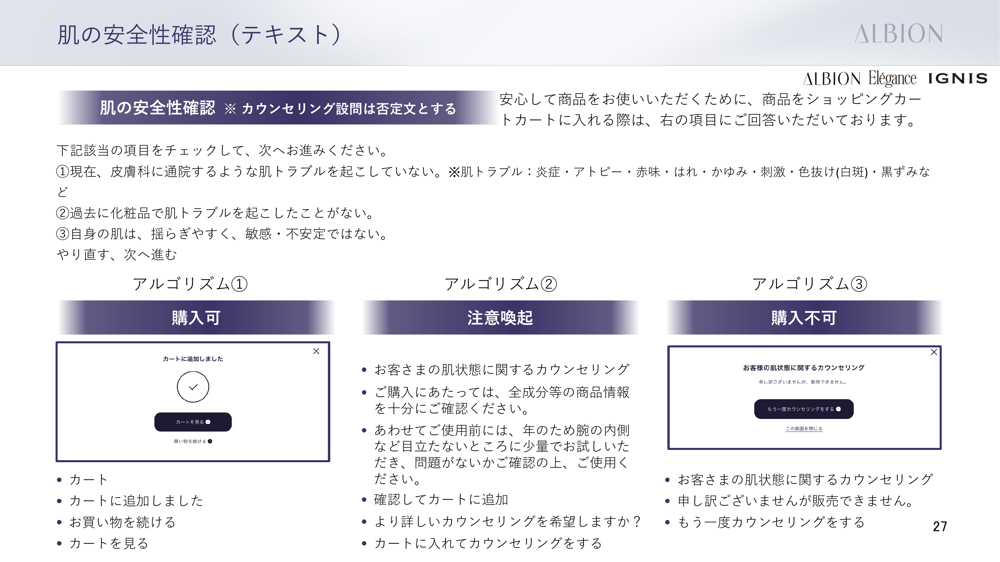

## 4) 商品詳細・運用ルール

- 商品詳細フォント:
- `ヒラギノ角ゴシック, Hiragino Sans, メイリオ, Meiryo, sans-serif`（優先順）。

- 商品画像運用:
- パックショット/切り抜き/色玉は提供データを使用。
- 切り抜き同士を重ねない。
- 切り抜き自体の加工をしない。
- 特殊画像は要相談（条件により二次使用料）。
- 任意: NEWマーク（発売日から最大60日）、色見本。

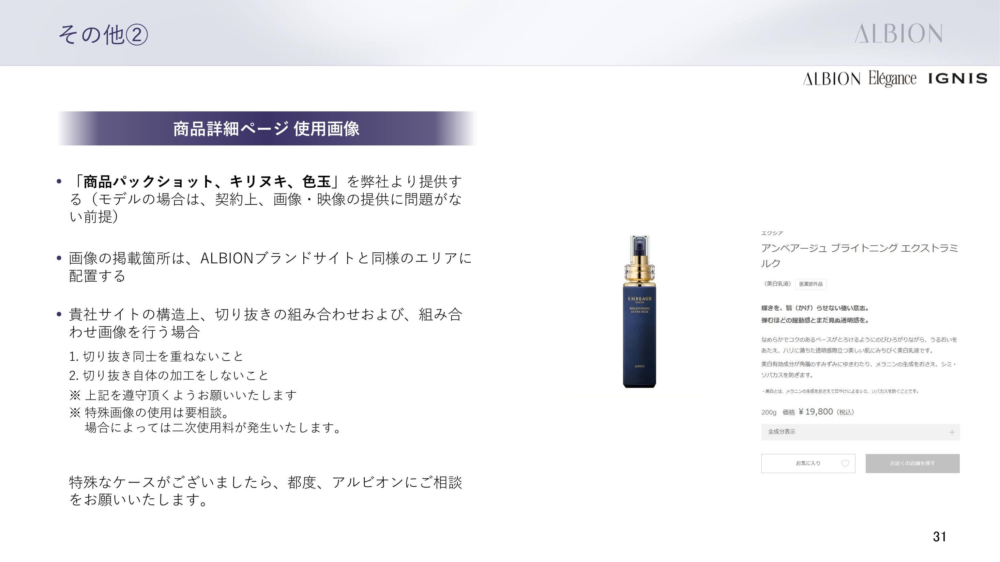

- 画角対応:
- 提供画角と貴社サイト画角に差異がある場合は、画像ベース類似色等で余白を埋めて画角調整。提供形式はJPEG/PNG/ai。縦横比率の変更は不可。トリミングは要相談。画像とテキスト併記の場合はセクションを分け、指定の画像加工は不可。

- バナー広告対応:
- 貴社TOPページでのバナー広告・PICK UPアイテム掲載・特集ページ掲載は営業戦略上、協議の上で積極的に実施。使用ロゴ・画像は本書APPENDIX規定に準ずる。

- 情報更新タイミング:
- 発売2か月前: 商品情報ページ公開。
- 発売月初1日: TOP更新（曜日により前倒しあり）。
- オンライン予約は実施しない。

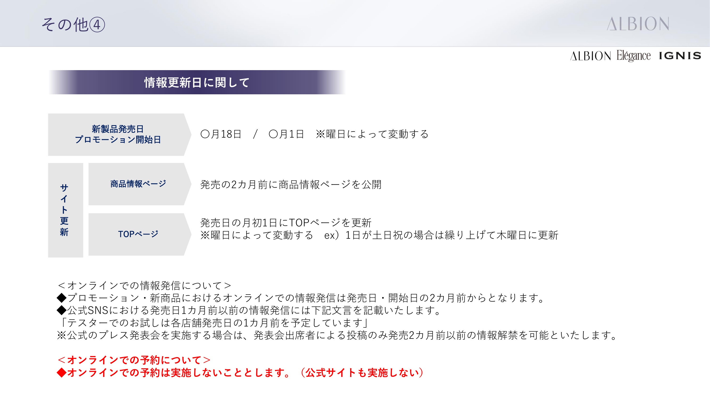

## 5) 導入・データ連携

- 新規取り扱いはガイドライン提供→サイト構築→当社確認→OPENの流れ。
- 必要データはロゴ、商品マスタ、TOPバナー、NEW ARRIVAL、RANKING、ABOUT ALBION素材。
- ABOUT ALBIONで動画使用の場合あり。対応可能な仕様で構築すること。
- 実績提供: センター出庫店は明細データ（CSV、毎月第5営業日まで）。店舗在庫出庫店はAtoSへの入力を実績発生時。
- サイトURL・正式店名の提供依頼: 公式取扱店舗掲載のため、ALBIONブランドTOPのURL・正式店名を提供。

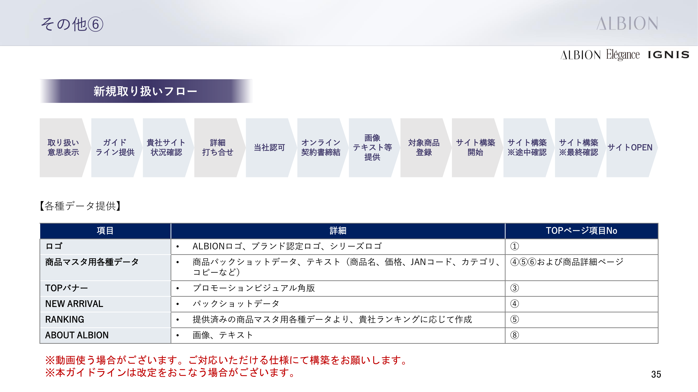

## 6) 別紙扱い（本PDFでは詳細未定義）

- 購入個数制限: 運用ルールとして提示（強制制御は必須ではない）。
- ALBION ID連携: 別紙「ID連携仕様書」で定義。

---

## 7) 提供アセット一覧（`docs/albion/` 配下）

以下のフォルダにガイドライン実装用の画像データが格納されている。ページ構成の要素（①〜⑦）に対応するアセットを整理する。

### ① ALBIONロゴ・認定ロゴ

| 用途 | パス | ファイル形式 |
|------|------|-------------|
| ブランドロゴ（ALBION） | `ブランドTOP/ブランドロゴ/` | ALBION.ai, ALBION.jpg |
| ブランドロゴ（Elegance） | `ブランドTOP/ブランドロゴ/` | Elegance①.ai, Elegance①.jpg |
| ブランドロゴ（IGNIS） | `ブランドTOP/ブランドロゴ/` | 新IGNISロゴ_カラー/黒(.ai, .jpg)、新IGNIS ioロゴ_黒(.ai, .jpg) |
| 認定ロゴ（任意掲載） | `ブランドTOP/（仮）認定ロゴ/` | albion/elegance/ignis_nintei_logo_black.jpg, _white.jpg |

### ③ TOPバナー（角版・月変動）

| サイズ | パス | 備考 |
|--------|------|------|
| PC: 1280×640px | `ブランドTOP_ビジュアル/{月}/PC/{AL\|EL\|IG}/` | JPEG。AL=ALBION, EL=Elegance, IG=IGNIS |
| SP: 750×1008px | `ブランドTOP_ビジュアル/{月}/SP/{AL\|EL\|IG}/` | JPEG。月ごとに枚数変動（現在MAX4枚想定） |

**例（4月）**: PC/AL: 2枚、PC/EL: 2枚、PC/IG: 2枚。SPも同数。

### ⑥ PRODUCTS

#### マストアイテム（5品）

| パス | ファイル |
|------|---------|
| `ブランドTOP/マストアイテム/` | フローラドリップ.png、セルフホワイトニングミッション.png、(1).png、エクラフチュール.png、スキンコンディショナー.png |

※商品詳細ページのデータを流用可能。増減の可能性あり。

#### シリーズから探す（カテゴリ一覧用画像）

| パス | シリーズ |
|------|----------|
| `ブランドTOP/アルビオンシリーズロゴ/` | FLARUNE.jpg, INFINESSE_新シリーズ.jpg, EXCIA.jpg, EMBEAGE_EXCIA.jpg, ALBION.jpg, ALBION STUDIO rogo.jpg, EX-VIE_GINZA.jpg, UV（SUPER_UV_CUT.jpg）, SPALANKA.jpg, Renasair.jpg, JOUIR.jpg |

PDF記載順: ①FLARUNE ②INFINESSE ③EXCIA ④EMBEAGE ⑤ALBION ⑥ALBIONSTUDIO ⑦EX-VIE ⑧UV ⑨SPALANKA ⑩RENASAIR ⑪JOUIR。

#### ブランド別カテゴリ画像（取引ブランドに応じて使用）

- **Elegance**: `ブランドTOP/エレガンス_カテゴリ画像/` — PNG（商品カテゴリ用）
- **IGNIS**: `ブランドTOP/★イグニス_カテゴリバナー/` — IGNIS-yoko（横）, IGNIS-tate（縦）。cleansing, cream, essence, facewash, lotion, milk, specialcare, tools 等
- **IGNIS io**: `ブランドTOP/★イグニスiO各種バナー/` — handcare, UV, skincare, bodycare, harecare, fragrance, top（PNG/JPEG）

### ⑦ ONLINE COUNSELING バナー

| パス | ファイル |
|------|---------|
| `ブランドTOP/オンラインカウンセリングバナー/` | G25101273-online-AL.jpg, -EL.jpg, -IG.jpg |

※`https://www.albion.co.jp/counseling/` への遷移用。グローバルナビ・PRODUCTS などから同様に遷移。

### アセット配置の注意

- **画角・形式**: 提供形式はJPEG/PNG/ai。画角差異時はガイドライン「画角対応」に従い余白調整。
- **重複フォルダ**: `（仮）認定ロゴ/ブランドロゴ/` には `ブランドロゴ/` と同内容のコピーあり。認定ロゴと組み合わせて使用する際の参考用。

### 自動アップロード（Shopify Files への投入）

`docs/albion/` の画像を Shopify Files へアップロードし、テンプレートの画像参照を更新するスクリプトを用意している。

1. **設定**: `scripts/albion-upload-config.json` を作成（`scripts/upload-config.example.json` を参考）
2. **アップロード**: `npm run albion:upload` を実行。事前確認は `npm run albion:upload:dry`。詳細は `scripts/README.md` を参照
3. **テンプレート反映**: `scripts/albion-upload-mapping.json` の内容を `templates/collection.albion.json` の該当ブロックに手動または AI エージェントで反映

必要な環境変数（`.env`）: `SHOPIFY_SHOP`、`SHOPIFY_CLIENT_ID`、`SHOPIFY_CLIENT_SECRET`（Dev Dashboard アプリ、`write_files` スコープ必須）
