# Elegance JSECシステムガイドライン ver.1（vo1）要点版

対象PDF: `docs/albion/Elegance_JSECシステムガイドライン_vo1.pdf`

このドキュメントは、実装と運用で必要な要件のみを抽出した要点版です。

## 1) ページ構成（必須要件）

- EleganceブランドTOPは以下の要素で構成する（表示順）。
- ① `Eleganceロゴ`、② `グローバルナビ`、③ `TOPバナー`、④ `NEW Items & Colors`、⑤ `RANKING`（任意）、⑥ `PRODUCTS`、⑦ `ONLINE COUNSELING`、⑧ `ABOUT Elegance`。
- `RANKING` は任意（掲載する場合はTOP掲載必須、販売数量TOP5を表示）。
- `ABOUT Elegance` は現時点では予定なし。

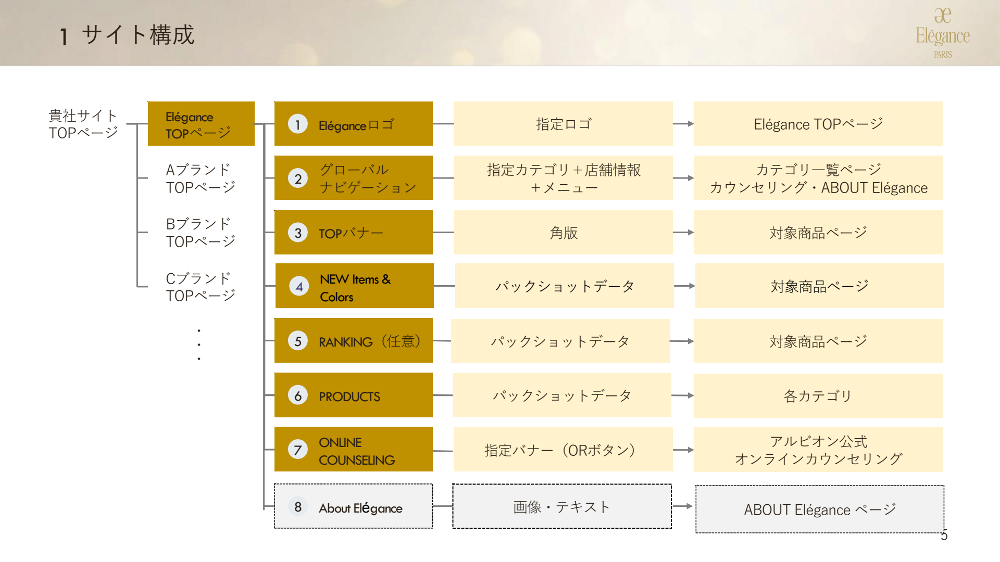

## 2) UI実装ルール（優先度高）

- ロゴ:
- Eleganceロゴは表示範囲の中央配置を必須。
- 認定ロゴとのサイズ・位置関係はガイド準拠。

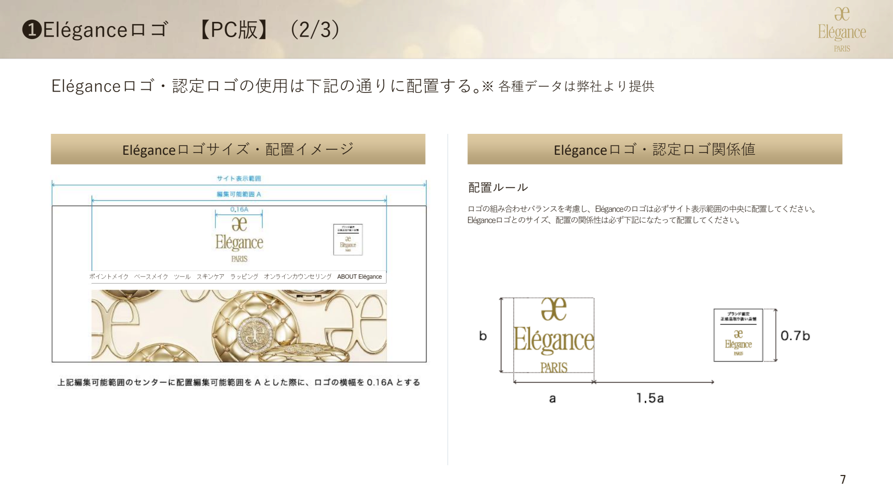
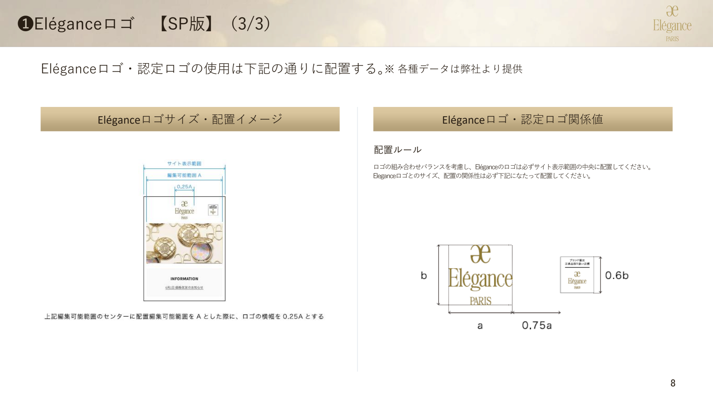

- グローバルナビ:
- 5カテゴリ（ポイントメイク、ベースメイク、ツール、スキンケア、ラッピング）＋オンラインカウンセリング。
- 詳細カテゴリはPCでホバー/アコーディオン、SPでタップ展開。詳細カテゴリの表示順はガイド記載順に準拠。
- 各詳細カテゴリの遷移先はカテゴリ一覧ページ。
- ※「アイ」からの遷移はカテゴリ「アイ」の全商品。公式サイトの「EYE」からの更に小分類は不要。画像提供不可。
- SPは不要（※グロナビはPCのみ想定）。

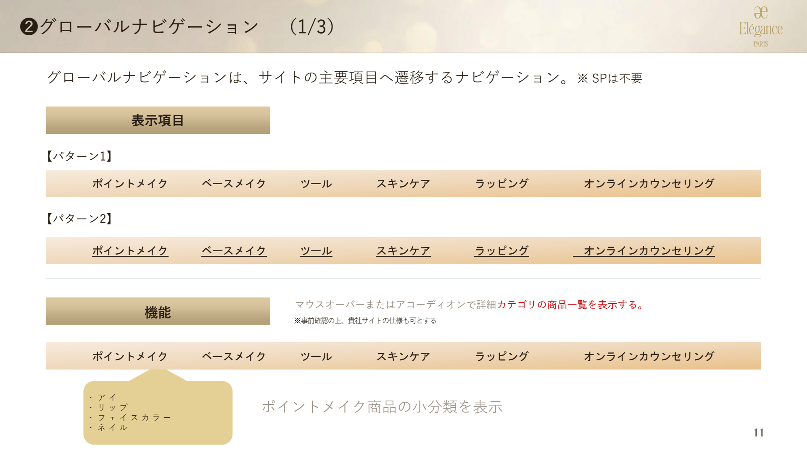
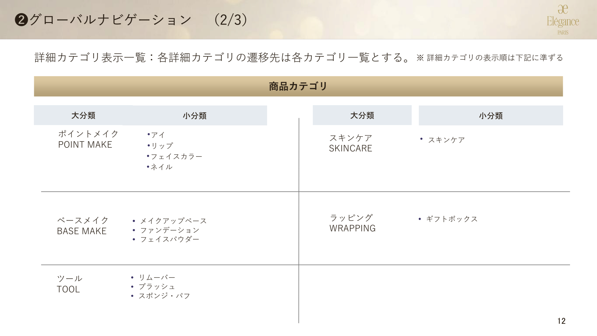
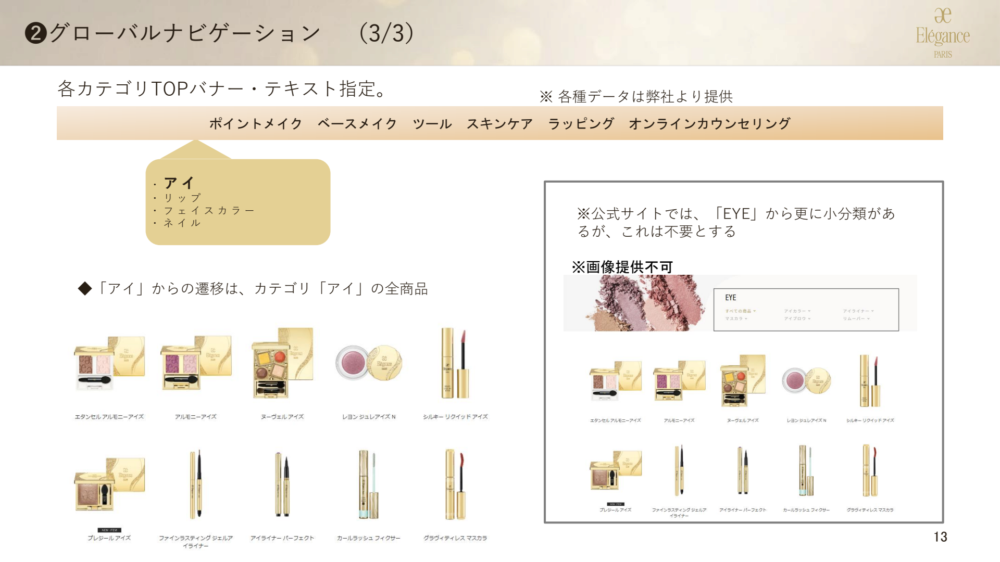

- TOPバナー:
- ALBION同様。角版を複数枚表示（横スクロール想定、掲載枚数は月ごと変動）。画像形式はJPEG。遷移先は単品または指定商品ページ。

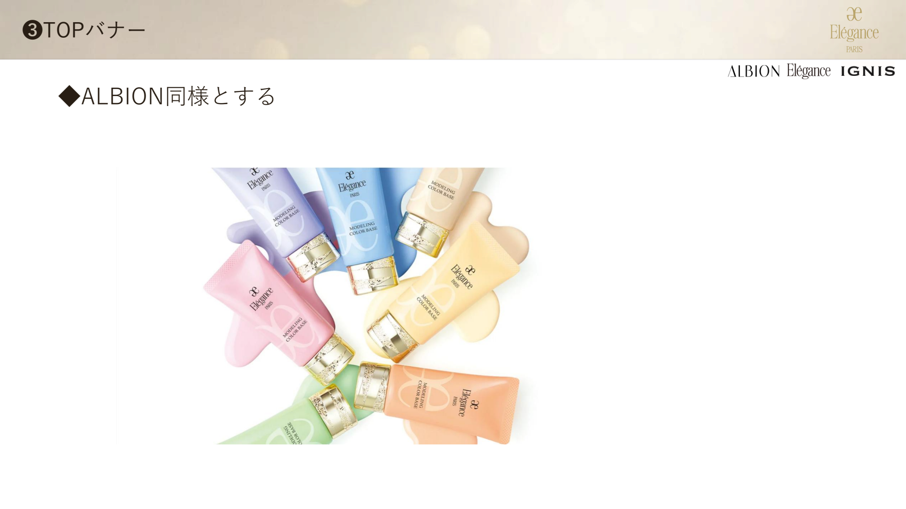

- NEW Items & Colors:
- ALBION同様。パックショットで新商品を新しい順で4品表示。

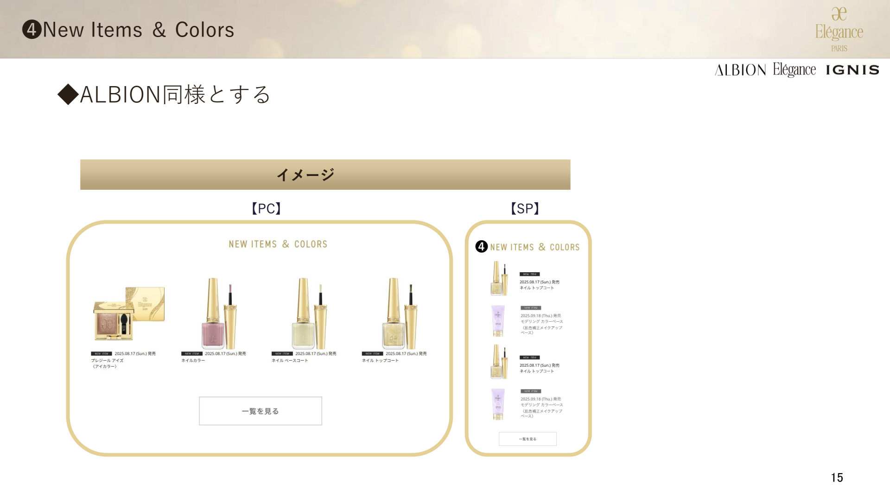

- RANKING:
- ALBION同様。TOP掲載時は販売数量TOP5。

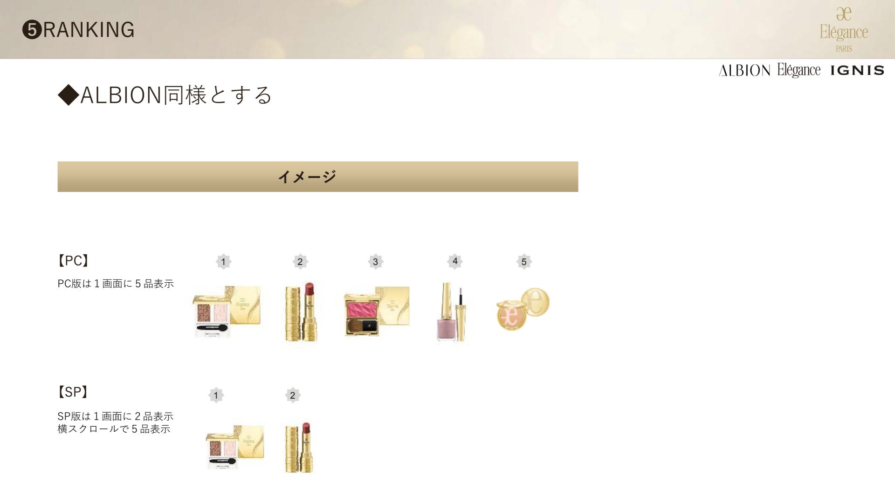

- PRODUCTS:
- **5カテゴリ**を表示: ①ポイントメイク ②ベースメイク ③ツール ④スキンケア ⑤ラッピング。
- 各カテゴリと小分類を表示。対象カテゴリ一覧ページへ遷移。
- 提供データ: JPEG、サイズは商品ごと。

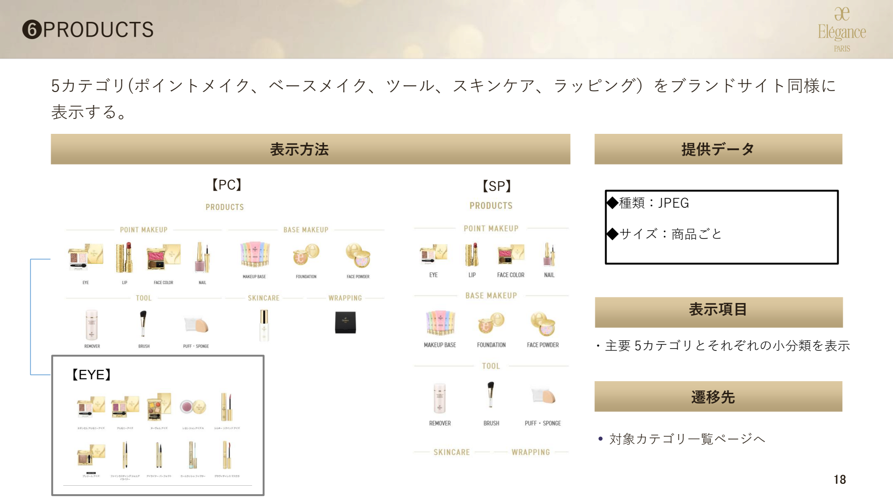

- ONLINE COUNSELING:
- ALBION同様。指定バナー（ORボタン）を提供。`https://www.albion.co.jp/counseling/` への遷移を実装。グローバルナビからも同様に遷移。

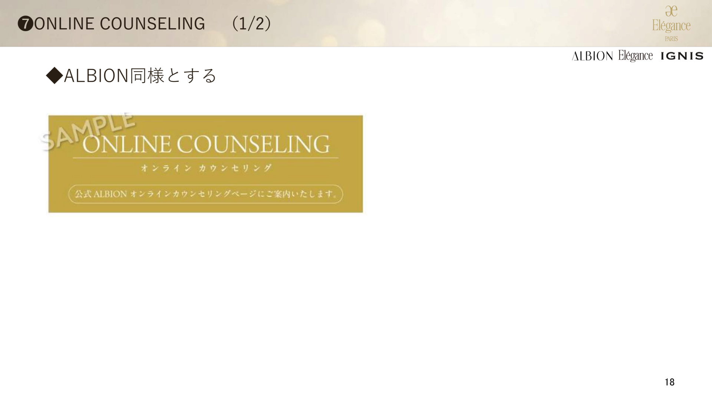

## 3) 購入前の肌安全性確認（必須）

- ALBIONと同一ロジック。
- 商品購入前に肌安全性確認モーダルを表示する（必須）。設問文は否定文で構成する（必須）。
- 画面種別は `アルゴリズム①(購入可)` / `アルゴリズム②(注意喚起)` / `アルゴリズム③(購入不可)` の3状態で出し分ける。

- 設問（チェック項目）:
- Q1: 現在、皮膚科に通院するような肌トラブルを起こしていない。（※肌トラブル：炎症・アトピー・赤味・はれ・かゆみ・刺激・色抜け(白斑)・黒ずみなど）
- Q2: 過去に化粧品で肌トラブルを起こしたことがない。
- Q3: 自身の肌は、揺らぎやすく、敏感・不安定ではない。

- 判定ロジック: `Q1=YES, Q2=YES, Q3=YES` → 購入可。`Q1=YES` かつ `Q2/Q3のいずれかがNO` → 注意喚起。`Q1=NO, Q2=NO, Q3=NO` → 購入不可。

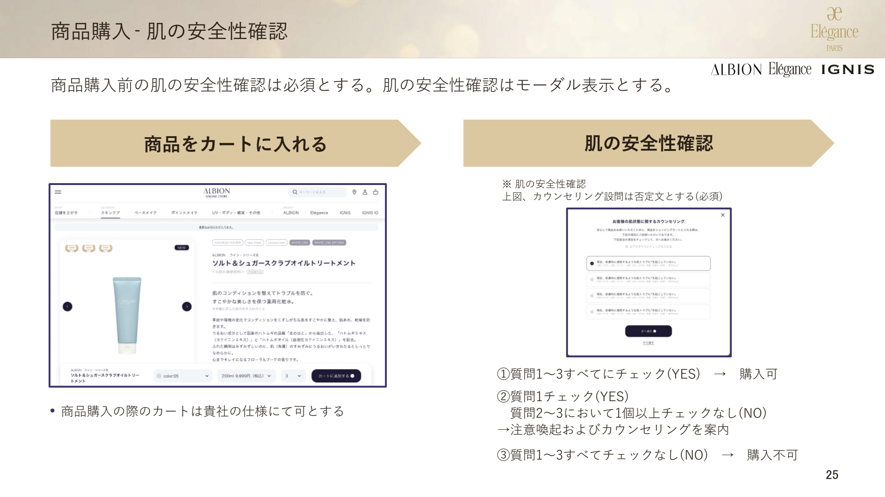
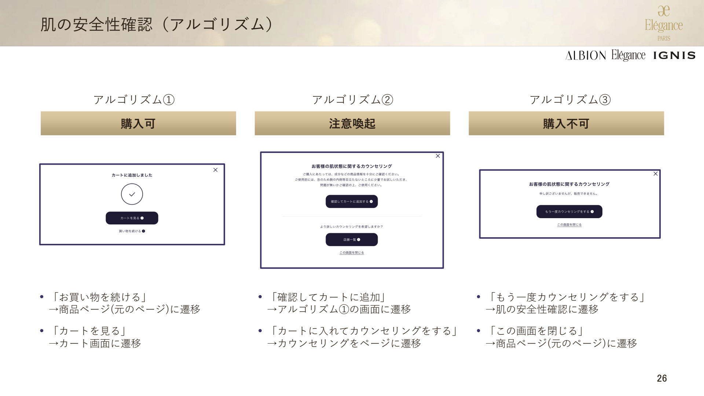
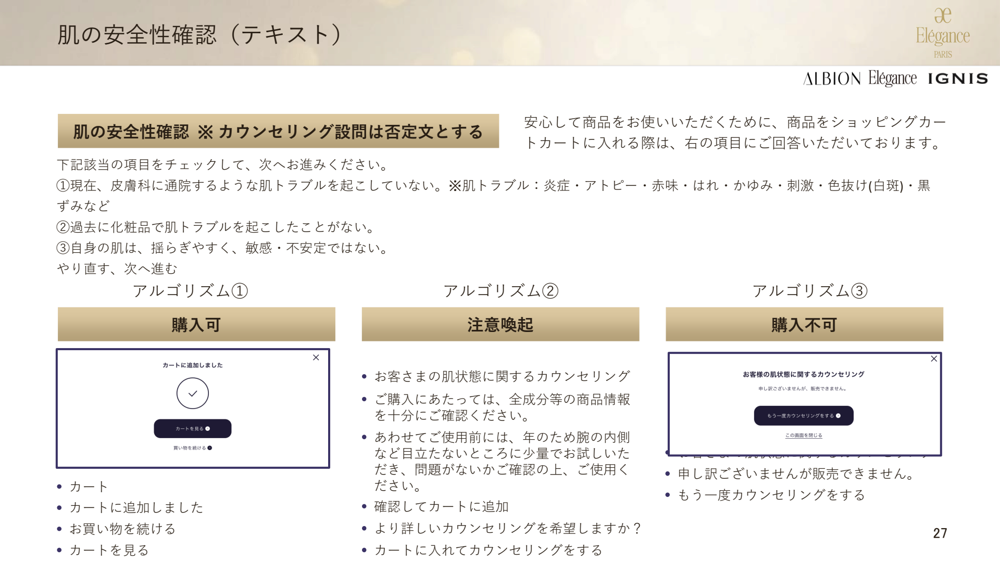

## 4) 商品詳細・運用ルール

- 商品詳細フォント:
- `Noto Sans, Source Han Sans JP, Noto Sans Japanese, Noto Sans JP, Hiragino Kaku Gothic ProN, Hiragino Kaku Gothic Pro, YuGothic, Meiryo, sans-serif`（優先順）。
- 適用項目: ブランド名/商品名/アイテム名、商品説明、レフィル価格/ケース価格、別売商品リンク（任意：セット価格）、カラー名・色説明・色見本画像、使用方法、セット方法 等。

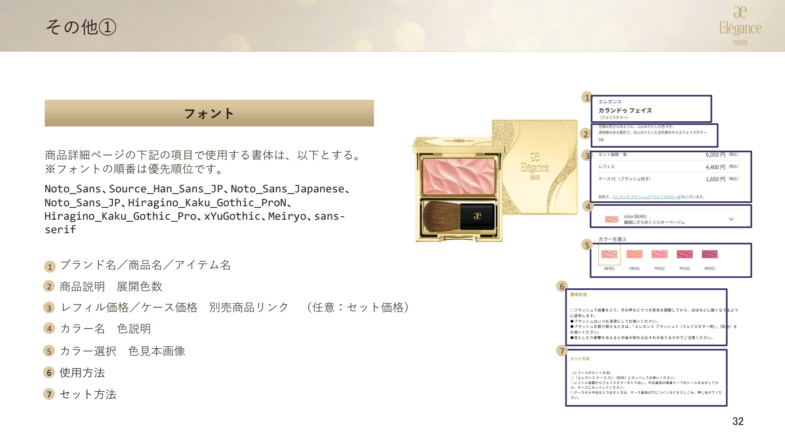

- 商品画像運用:
- パックショット/切り抜き/色玉は提供データを使用。
- 切り抜き同士を重ねない。切り抜き自体の加工をしない。
- 特殊画像は要相談（条件により二次使用料）。

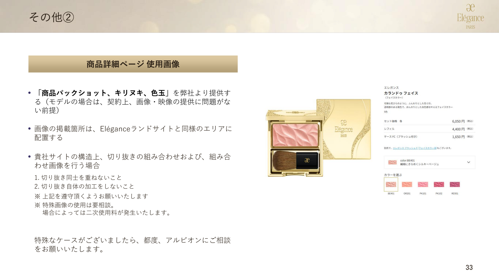

## 5) 導入・データ連携

- ALBIONと同様。新規取り扱いはガイドライン提供→サイト構築→当社確認→OPENの流れ。

## 6) 別紙扱い（本PDFでは詳細未定義）

- 購入個数制限: 運用ルールとして提示（強制制御は必須ではない）。
- ALBION ID連携: 別紙「ID連携仕様書」で定義。

---

## 7) 提供アセット一覧（Elegance用・`docs/albion/` 配下）

### ① Eleganceロゴ・認定ロゴ

| 用途 | パス | ファイル形式 |
|------|------|-------------|
| ブランドロゴ（Elegance） | `ブランドTOP/ブランドロゴ/` | Elegance①.ai, Elegance①.jpg |
| 認定ロゴ（任意掲載） | `ブランドTOP/（仮）認定ロゴ/` | elegance_nintei_logo_black.jpg, elegance_nintei_logo_white.jpg |

### ③ TOPバナー

| サイズ | パス | 備考 |
|--------|------|------|
| PC: 1280×640px | `ブランドTOP_ビジュアル/{月}/PC/EL/` | JPEG |
| SP: 750×1008px | `ブランドTOP_ビジュアル/{月}/SP/EL/` | JPEG |

### ⑥ PRODUCTS（5カテゴリ用）

| パス | 用途 |
|------|------|
| `ブランドTOP/エレガンス_カテゴリ画像/` | ポイントメイク、ベースメイク、ツール、スキンケア、ラッピング各カテゴリ用 PNG |

### ⑦ ONLINE COUNSELING バナー

| パス | ファイル |
|------|---------|
| `ブランドTOP/オンラインカウンセリングバナー/` | G25101273-online-EL.jpg |

※`https://www.albion.co.jp/counseling/` への遷移用。

### アセット配置の注意

- **画角・形式**: 提供形式はJPEG/PNG/ai。画角差異時はガイドライン「画角対応」に従い余白調整。
- **自動アップロード**: `scripts/elegance-upload-config.json` を作成し、`node scripts/shopify-upload-files.mjs --config=scripts/elegance-upload-config.json` で Shopify Files へ投入可能。詳細は `scripts/README.md` を参照。
