# IGNIS JSECシステムガイドライン ver.1（vol2）要点版

対象PDF: `docs/albion/IGNIS_JSECシステムガイドライン_vol2.pdf`

このドキュメントは、実装と運用で必要な要件のみを抽出した要点版です。

## 1) ページ構成（必須要件）

- IGNISブランドTOPは以下の要素で構成する（表示順）。
- ① `IGNISロゴ`、② `グローバルナビ`、③ `TOPバナー`、④ `NEW Items`、⑤ `RANKING`（任意）、⑥ `PRODUCTS`、⑦ `ONLINE COUNSELING`、⑧ `ABOUT IGNIS`、⑨ `IGNIS iO`。
- `RANKING` は任意（掲載する場合はTOP掲載必須、販売数量TOP5を表示）。
- `ABOUT IGNIS` は現時点では予定なし。
- `IGNIS iO` はIGNIS姉妹ブランドへの導線。IGNISサイト最下部にリンク設置。

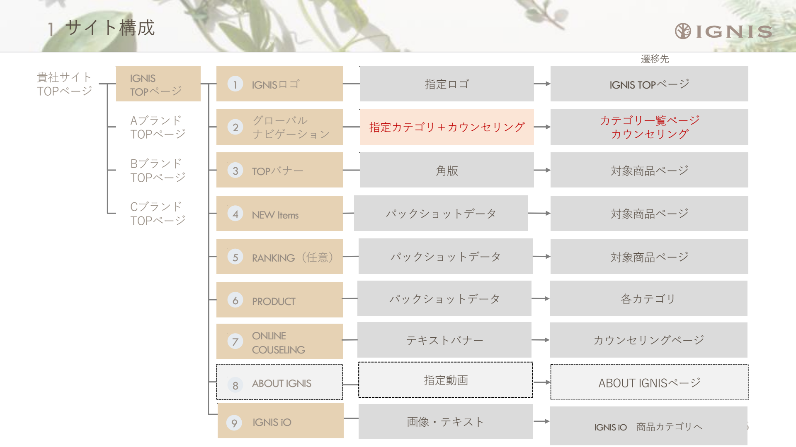

## 2) UI実装ルール（優先度高）

- ロゴ:
- IGNISロゴは表示範囲の中央配置を必須。
- 認定ロゴとのサイズ・位置関係はガイド準拠。

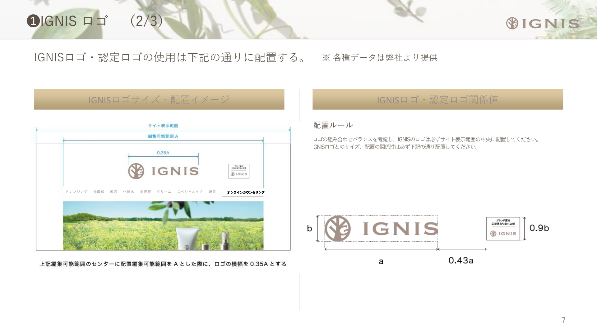
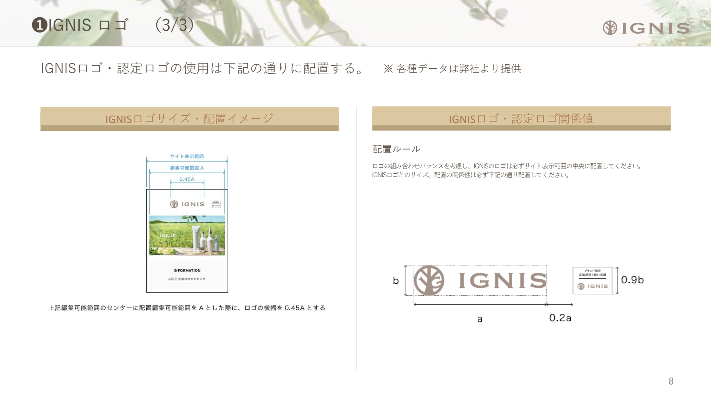

- グローバルナビ:
- 8カテゴリ（クレンジング、洗顔料、乳液、化粧水、美容液、クリーム、スペシャルケア、雑貨）＋オンラインカウンセリング。
- 「新商品」「IGNIS iO」はグロナビに表示しない。
- 各カテゴリの一覧ページに遷移。「オンラインカウンセリング」は外部指定ページへ遷移。
- SPは不要（※グロナビはPCのみ想定）。

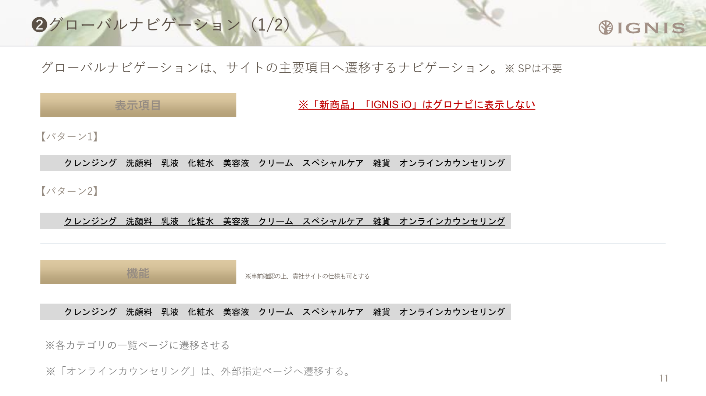
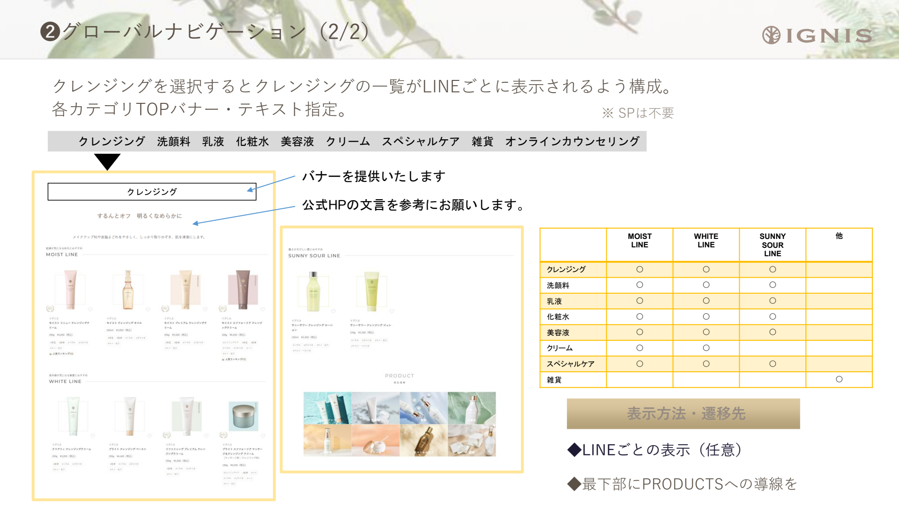

- TOPバナー:
- ALBION同様。角版を複数枚表示（横スクロール想定、掲載枚数は月ごと変動）。画像形式はJPEG。遷移先は単品または指定商品ページ。

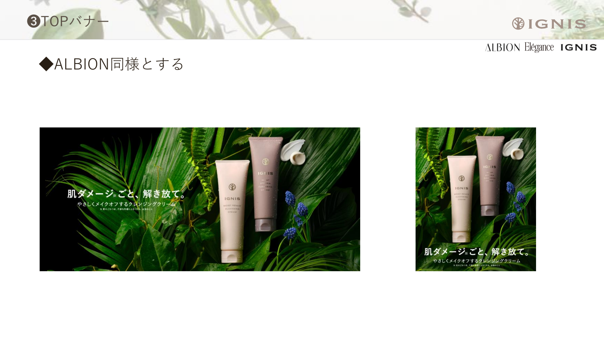

- NEW Items:
- ALBION同様。パックショットで新商品を表示。「一覧を見る」は任意（IGNISは新製品が少ないため）。カルーセル仕様は8〜12品対応を推奨（季節ごとに1〜3品が基本）。

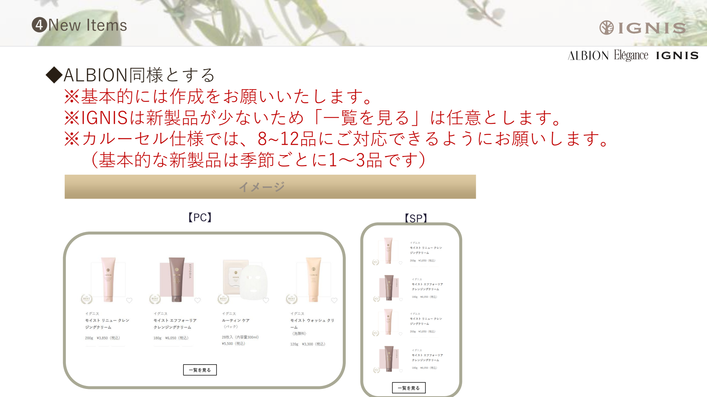

- RANKING:
- ALBION同様。TOP掲載時は販売数量TOP5。

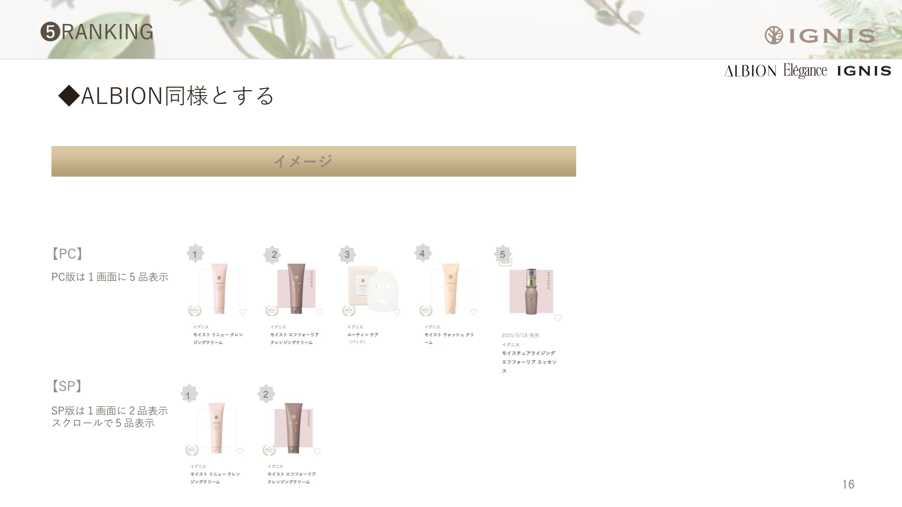

- PRODUCTS:
- **8カテゴリ**を表示: クレンジング、洗顔料、乳液、化粧水、美容液、クリーム、スペシャルケア、雑貨。
- 各カテゴリの一覧ページへ遷移。LINEごとの表示（MOIST、WHITE、SUNNY等）は任意。カテゴリバナー・テキストは提供データ使用。
- SP版は縦積み。公式HPを参考に。

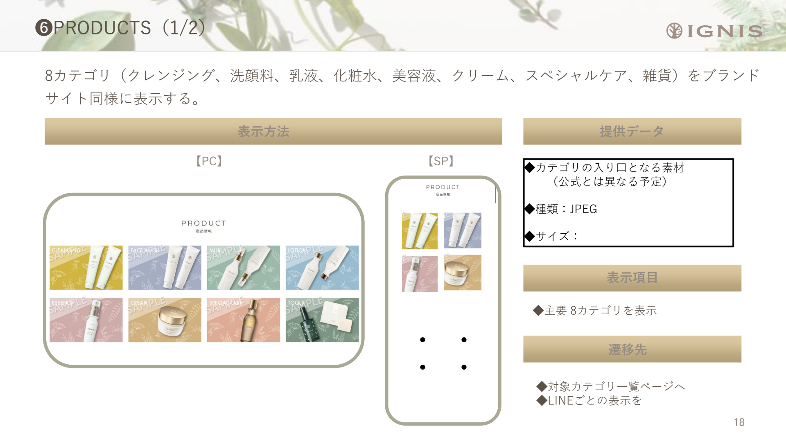
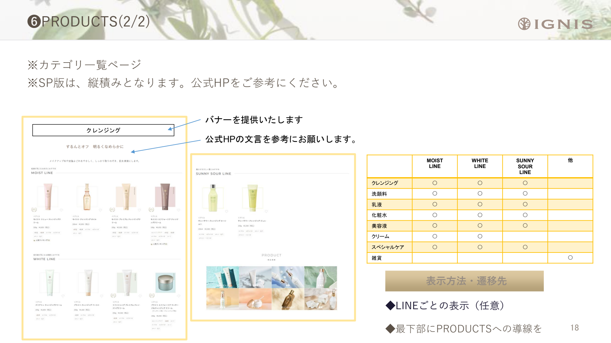

- ONLINE COUNSELING:
- ALBION同様。`https://www.albion.co.jp/counseling/` への遷移を実装。グローバルナビからも同様に遷移。

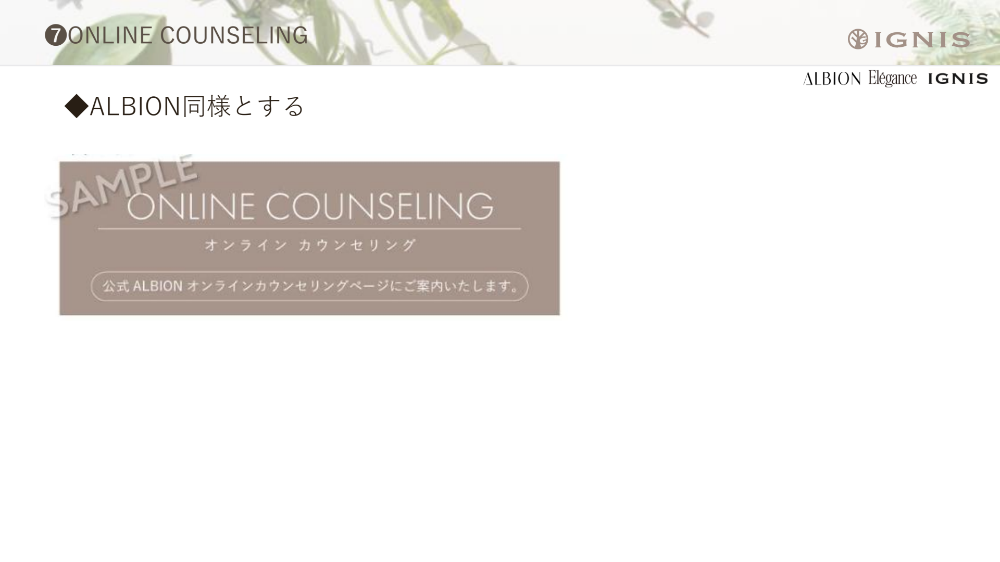

- IGNIS iO（⑨・IGNIS専用）:
- IGNIS姉妹ブランドとしてIGNISサイト最下部にリンクを設置。
- 「商品一覧を見る」→ IGNIS iO全商品一覧ページへ遷移。
- iO全商品一覧ページ最下部にIGNISへの導線（→IGNIS TOPへ）を設置。
- iO PRODUCT最下部・カテゴリ一覧最下部にIGNISへの導線を設置。
- SP版は公式HP（SP）を参考に縦積みで構成。

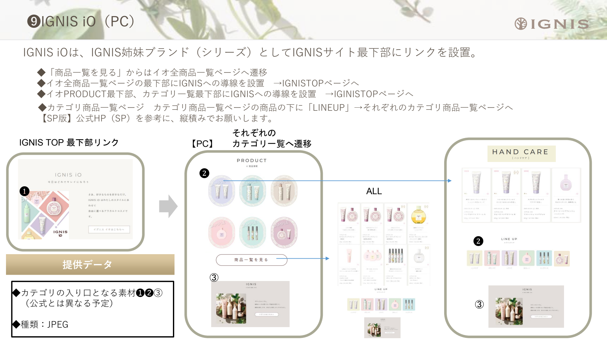

## 3) 購入前の肌安全性確認（必須）

- ALBIONと同一ロジック。
- 商品購入前に肌安全性確認モーダルを表示する（必須）。設問文は否定文で構成する（必須）。
- 画面種別は `アルゴリズム①(購入可)` / `アルゴリズム②(注意喚起)` / `アルゴリズム③(購入不可)` の3状態で出し分ける。

- 設問（チェック項目）:
- Q1: 現在、皮膚科に通院するような肌トラブルを起こしていない。（※肌トラブル：炎症・アトピー・赤味・はれ・かゆみ・刺激・色抜け(白斑)・黒ずみなど）
- Q2: 過去に化粧品で肌トラブルを起こしたことがない。
- Q3: 自身の肌は、揺らぎやすく、敏感・不安定ではない。

- 判定ロジック: `Q1=YES, Q2=YES, Q3=YES` → 購入可。`Q1=YES` かつ `Q2/Q3のいずれかがNO` → 注意喚起。`Q1=NO, Q2=NO, Q3=NO` → 購入不可。

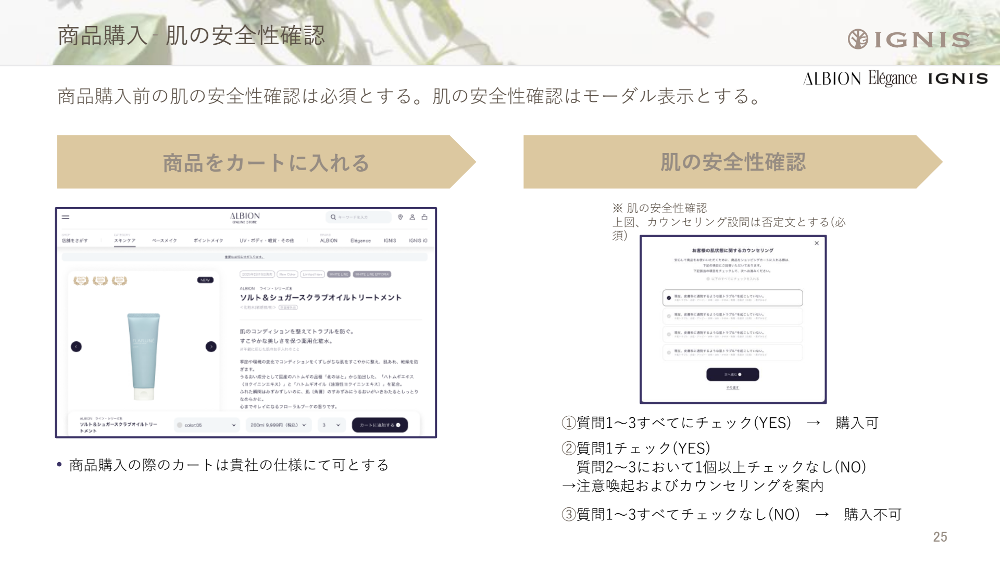
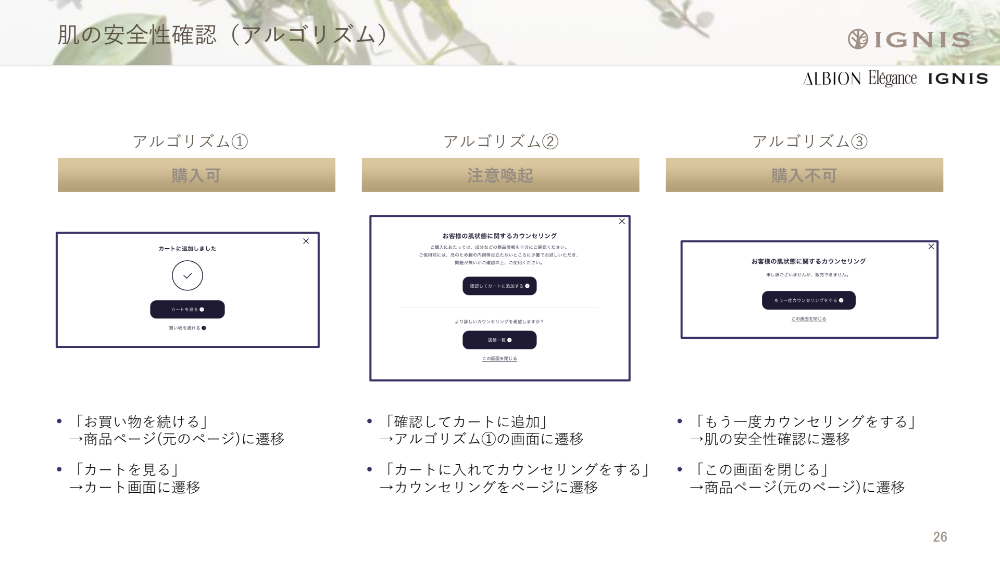
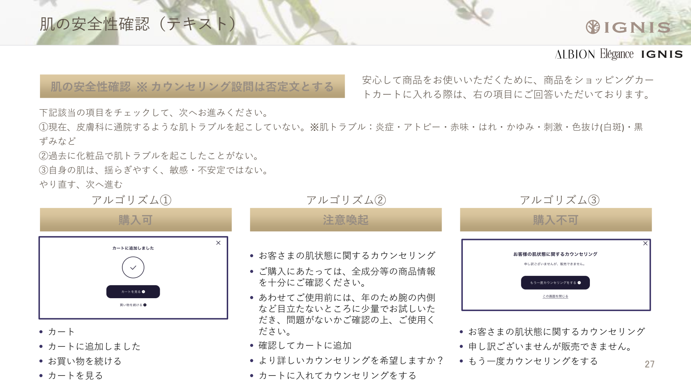

## 4) 商品詳細・運用ルール

- 商品詳細フォント:
- `Hiragino Kaku Gothic Pro, Hiragino Kaku Gothic ProN, 游ゴシック体, YuGothic, 游ゴシック Medium, Yu Gothic Medium, 游ゴシック, Yu Gothic, メイリオ, noto-sans-cjk-jp, ＭＳＰゴシック, sans-serif`（優先順）。
- 適用項目: シリーズ名、ブランド名、商品名、容量・価格、商品説明、使用方法 等。

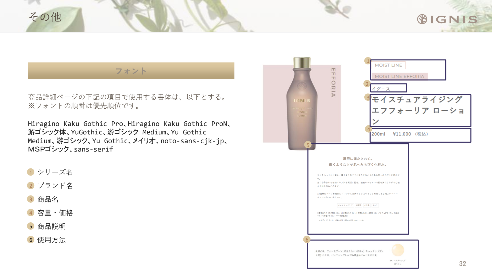
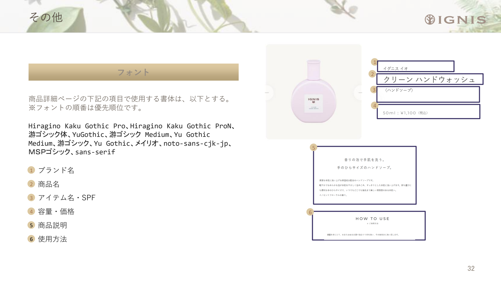

- 商品画像運用:
- パックショット/切り抜き/色玉は提供データを使用。
- 切り抜き同士を重ねない。切り抜き自体の加工をしない。
- 特殊画像は要相談（条件により二次使用料）。

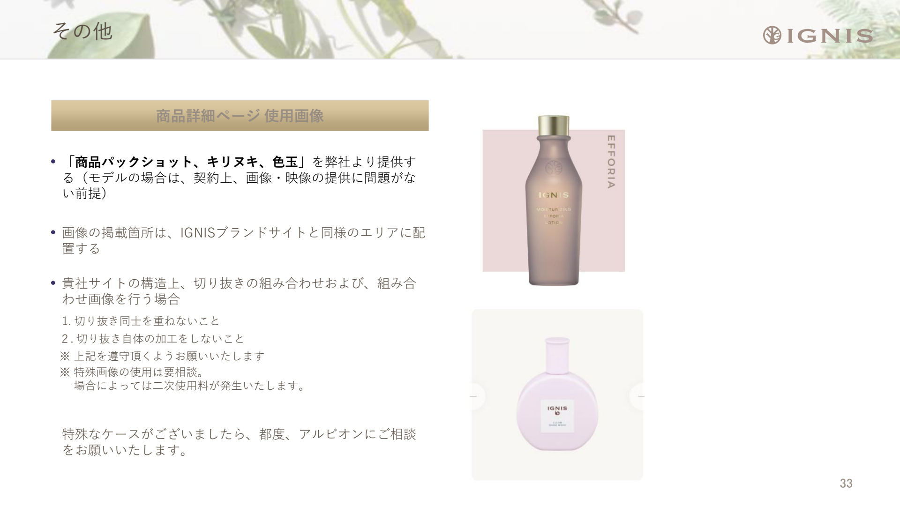

## 5) 導入・データ連携

- ALBIONと同様。新規取り扱いはガイドライン提供→サイト構築→当社確認→OPENの流れ。

## 6) 別紙扱い（本PDFでは詳細未定義）

- 購入個数制限: 運用ルールとして提示（強制制御は必須ではない）。
- ALBION ID連携: 別紙「ID連携仕様書」で定義。

---

## 7) 提供アセット一覧（IGNIS用・`docs/albion/` 配下）

### ① IGNISロゴ・認定ロゴ

| 用途 | パス | ファイル形式 |
|------|------|-------------|
| ブランドロゴ（IGNIS） | `ブランドTOP/ブランドロゴ/` | 新IGNISロゴ_カラー/黒(.ai, .jpg)、新IGNIS ioロゴ_黒(.ai, .jpg) |
| 認定ロゴ（任意掲載） | `ブランドTOP/（仮）認定ロゴ/` | ignis_nintei_logo_black.jpg, ignis_nintei_logo_white.jpg |

### ③ TOPバナー

| サイズ | パス | 備考 |
|--------|------|------|
| PC: 1280×640px | `ブランドTOP_ビジュアル/{月}/PC/IG/` | JPEG |
| SP: 750×1008px | `ブランドTOP_ビジュアル/{月}/SP/IG/` | JPEG |

### ⑥ PRODUCTS（8カテゴリ用）

| パス | 用途 |
|------|------|
| `ブランドTOP/★イグニス_カテゴリバナー/` | IGNIS-yoko（横）、IGNIS-tate（縦）。cleansing, cream, essence, facewash, lotion, milk, specialcare, tools 等 |

### ⑨ IGNIS iO

| パス | 用途 |
|------|------|
| `ブランドTOP/★イグニスiO各種バナー/` | handcare, UV, skincare, bodycare, harecare, fragrance, top（PNG/JPEG） |

### ⑦ ONLINE COUNSELING バナー

| パス | ファイル |
|------|---------|
| `ブランドTOP/オンラインカウンセリングバナー/` | G25101273-online-IG.jpg |

※`https://www.albion.co.jp/counseling/` への遷移用。

### アセット配置の注意

- **画角・形式**: 提供形式はJPEG/PNG/ai。画角差異時はガイドライン「画角対応」に従い余白調整。
- **自動アップロード**: `scripts/ignis-upload-config.json` を作成し、`node scripts/shopify-upload-files.mjs --config=scripts/ignis-upload-config.json` で Shopify Files へ投入可能。詳細は `scripts/README.md` を参照。
